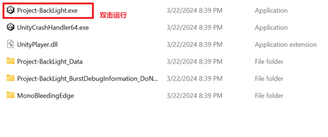
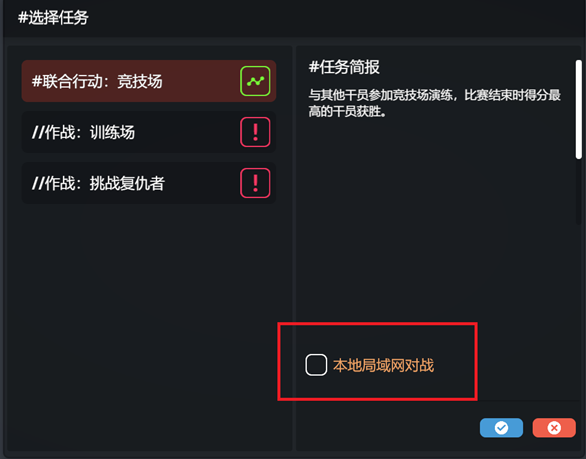

# Project-BackLight-Release
## V0.4.0 [下载](https://github.com/Nedlitex/Project-BackLight-Release/releases/download/v0.4.0/Project-BackLight-v0.4.0.zip)
1. 增加了联机模式
2. 增加了教程模式

## 注意
1. 下载并解压缩以后双击`Project-BackLight.exe`文件运行游戏

2. 第一次启动时如果系统提醒未知软件，请选择继续运行。
3. 第一次启动联网模式时系统会询问是否允许程序访问网络，请选择允许访问公共网络。
4. 进行联网模式时，如果勾选“本地局域网”选项则只有在同一局域网下的玩家才能联机。不选这个选项则会基于Unity的RelayService进行联机。

## 游戏模式介绍

### 竞技场
目前的v0.4.0测试版本支持竞技场模式：由至多8名玩家各自操作一位干员进行大乱斗。

得分规则：
- 击倒敌人获得1分。被击倒的干员将在10秒后重新部署。
- 地图上会刷新战略点。在战略点内累计10秒以后获得3分。如果战略点内有多个干员则计时暂停。
